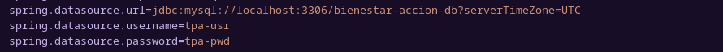
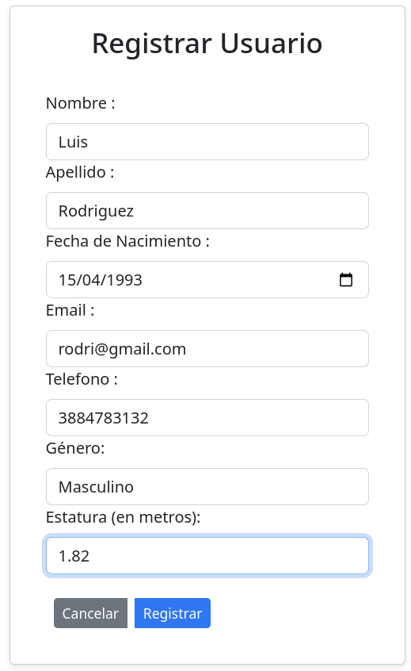
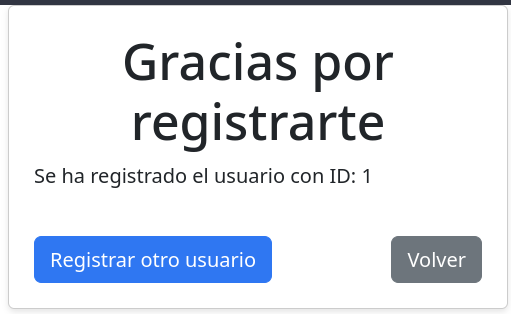
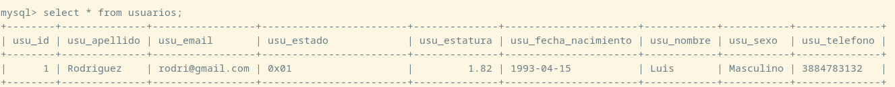
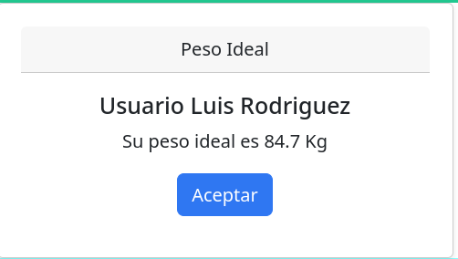

# 	Bienestar en Acción
**Introducción:** El proyecto trata de una plataforma web de salud y bienestar relacionada con dietas saludables y
seguimientos de alimentación. La aplicación esta desarrollada bajo la plataforma de Java a traves del framework Spring Boot. Las paginas están desarrollada a través del framework Bootstrap para que sean responsivas, es decir, que la pagina se adapte al tamaño de la pantalla del dispositivo. La arquitectura utilizada en el proyecto es el MVC (modelo, vista y controlador). La base de datos utilizada para conectar el proyecto es el Mysql version 8.

## Manual de la aplicación 

### Configuración de la aplicación

Para ejecutar la aplicación debemos tener configurado el archivo **application.properties** en cual definiremos el nombre de la base de datos, el usuario y la contraseña los cuales ya tienen que estar configurado en la base de datos para poder ejecutar la aplicación.

Luego de haber configurado las configuraciones previamente mencionada ejecutamos la aplicación. Colocamos en el navegador la url **localhost:8080** porque el proyecto esta configurada por defecto en el puerto 8080.

### Uso de la aplicación

Para usar la aplicación el usuario se tiene que registrar previamente. En la opción registrarme y cargamos los datos del usuario.

Una vez validado los datos del formulario se confirma la carga de datos.

Se almacenara los datos en la base de datos.

Nos dirigimos a Servicio en la opción de Peso ideal para que el usuario obtenga su peso ideal. Pero antes de obtener el resultado, la aplicación le pedirá al usuario que ingrese el id que adquirió cuando se registro. En caso de no estar registrado la aplicación le mandara un mensaje de error indicando que el **usuario no esta registrado**. Una vez validado el id del usuario le mostrara el peso ideal.

