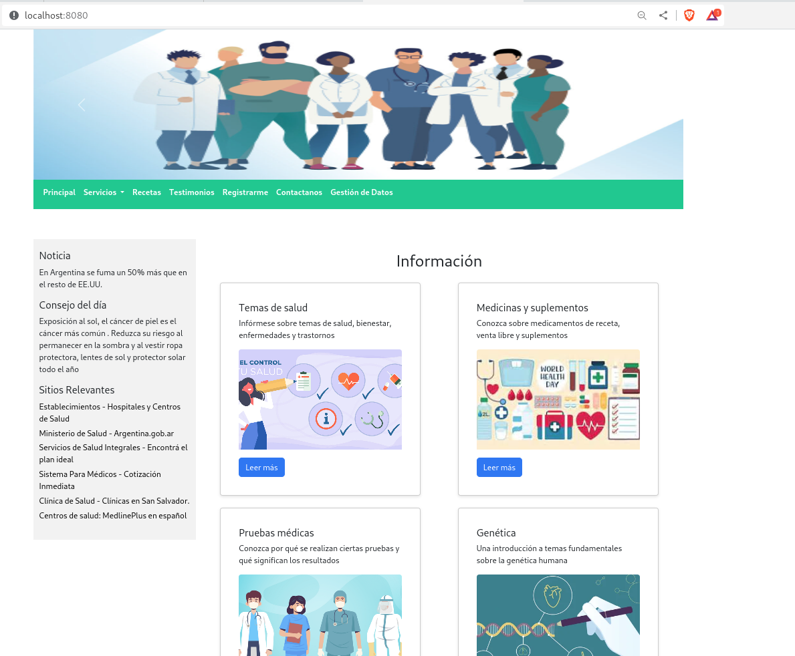
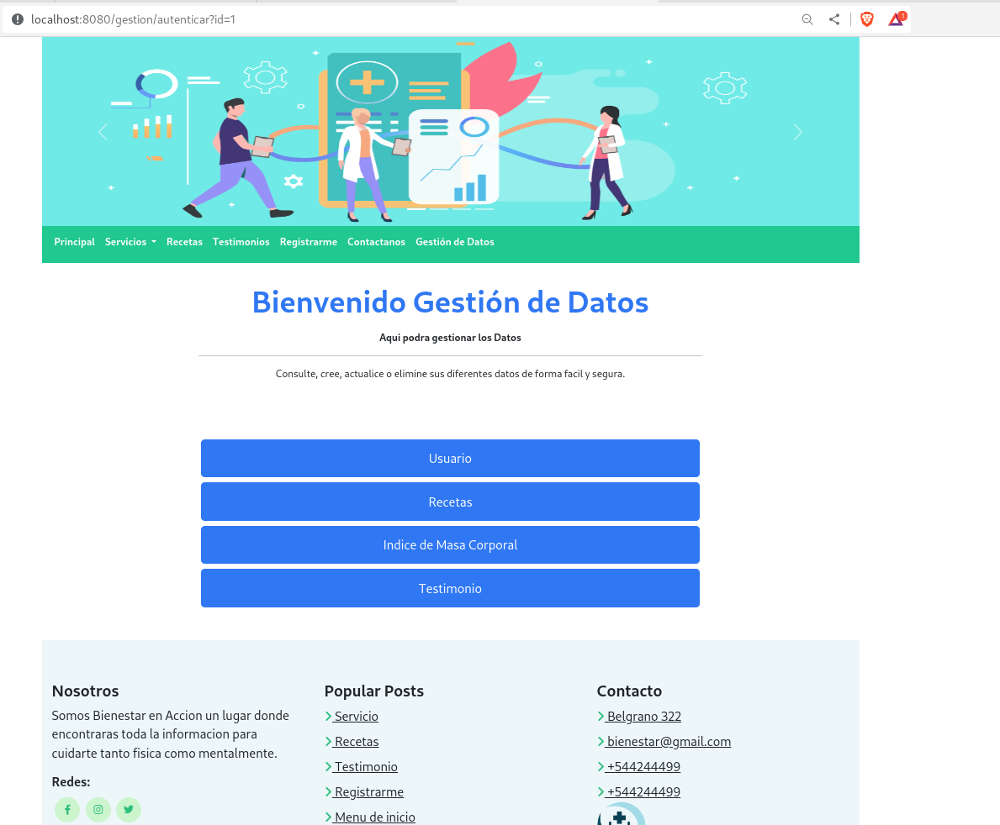

# 	Bienestar en Acción
**Introducción:** El proyecto trata de una plataforma web de salud y bienestar relacionada con dietas saludables y
seguimientos de alimentación. La aplicación esta desarrollada bajo la plataforma de Java a traves del framework Spring Boot.

## Características del Proyecto 

+ La versión de Spring Boot es 3.1.1 .
+ La versión de java es la  17.
+ La arquitectura de diseño es el MVC(modelo, vista y controlador).
+ La base de datos utilizada es el Mysql versión 8.
+ Se utiliza Bootstrap para el diseño responsivo de las paginas.

+ **Las dependencias usadas son :**
* spring-boot-starter-thymeleaf
* spring-boot-starter-web
* spring-boot-devtools
* org.webjar
* org.webjars
* spring-boot-starter-validation
* spring-boot-starter-data-jpa
* mysql-connector-java
* spring-boot-starter-test

### Configuración de la aplicación

Para ejecutar la aplicación debemos tener configurado el archivo **application.properties** en cual definiremos el nombre de la base de datos, el usuario y la contraseña los cuales ya tienen que estar configurado en la base de datos para poder ejecutar la aplicación.

Luego de haber configurado las configuraciones previamente mencionada ejecutamos la aplicación. Colocamos en el navegador la url **localhost:8080** porque el proyecto esta configurada por defecto en el puerto 8080.

### Uso de la aplicación

Para usar la aplicación el usuario se tiene que registrar previamente. En la opción registrarme y cargamos los datos del usuario. Una vez validado los datos podrá utilizar la plataforma.

Para dirigirse a la pagina gestión de datos el usuario deber tener el rol de administrador. En caso contrario no podrá acceder a todos los datos del sistema.

